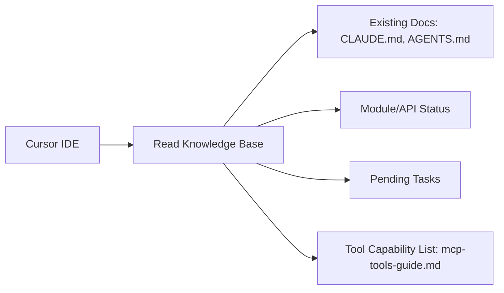

# Project Collaboration Requirements Document

## Background

You are currently developing and iterating in a macOS environment using the following combination:

- **Cursor IDE**: As the main collaboration/orchestration platform.
- Claude Code (MCP service) and Codex (MCP service) have been configured and verified to be callable by Cursor.
- The project has been developed and will continue to iterate; the project already has extensive documentation (e.g., `CLAUDE.md`, `AGENTS.md`, etc.).
- The goal is for these tools (Cursor + Claude Code + Codex) to work collaboratively and share a unified knowledge base to avoid situations where tools/models cannot understand the codebase when switching.

## Objectives

1. Build a **shared project knowledge base**: Including code structure, module descriptions, API documentation, change history, tool/model capability lists, task status, etc.
   - When building the knowledge base, try to **reuse existing documentation** and avoid having duplicate documents for the same functionality.
   - For existing documents (such as `CLAUDE.md`, `AGENTS.md`), clarify sources, content differences, and consolidate.
2. Enable Cursor IDE to read Claude Code and Codex tool/capability lists and assign roles to them accordingly.
3. Define the following mechanisms in the development iteration workflow:
   - Cursor IDE: As the orchestration/collaboration platform.
   - Claude Code: Responsible for exploration/coordination/precise operation tasks (such as code search, file operations, task management, test running, document processing).
   - Codex: Responsible for complex generation/reasoning tasks (such as large-scale code generation, complex refactoring, multi-round reasoning, long-running auditable execution).
   - All tools/models read context from the shared knowledge base before execution and write results to the knowledge base after output completion.
4. Ensure this workflow runs smoothly in macOS environment: stable tool service calls, normal knowledge base access, no document redundancy.

---

## Roles and Responsibilities

### Cursor IDE (Platform/Orchestration Tool)

- Read current state, existing documentation, module descriptions, API definitions, change history from the project knowledge base.
- Read Claude Code and Codex tool/capability lists.
- Assign tasks to Claude Code or Codex based on task type.
- Call corresponding services and monitor execution.
- Receive service output, review/consolidate (if needed) and update knowledge base.
- Manage task queue, tool switching, and knowledge base synchronization.

### Claude Code (MCP Service) — Exploration/Coordination/Precise Operations

Based on the tool analysis in `mcp-tools-guide.md`, Claude Code has **16 specialized tools** in 6 categories:

#### Core Capabilities

| Capability Category | Tools | Responsibility Description |
|---------|------|---------|
| **Code Operations** | `Read`, `Edit`, `Write`, `NotebookEdit` | File reading, precise string replacement editing, file writing, Jupyter notebook editing |
| **Code Search** | `Grep`, `Glob`, `Task` | Regex search (ripgrep), file pattern matching, launch specialized agents (code-reviewer, test-runner) |
| **Terminal Operations** | `Bash`, `BashOutput`, `KillShell` | Execute shell commands, get background output, terminate processes |
| **Task Management** | `TodoWrite`, `ExitPlanMode` | Create task lists, manage progress, exit plan mode |
| **Network Information** | `WebFetch`, `WebSearch` | Get web content, web search |
| **Special Functions** | `Skill`, `SlashCommand` | Handle PDF/Excel, execute custom commands |

#### Suitable Task Types

- ✅ **Codebase Exploration**: Use `Glob` to locate files, `Grep` to search code patterns, `Read` to understand code structure
- ✅ **Precise Code Modification**: Use `Edit` for string replacement, variable renaming, batch replacement
- ✅ **Task Decomposition and Management**: Use `TodoWrite` to break down complex tasks, track progress
- ✅ **Testing and Building**: Use `Bash` to run `npm test`, `npm build`, `git` operations
- ✅ **Code Review**: Use `Task` to launch code-reviewer agent
- ✅ **Document Processing**: Use `WebFetch` to get online documentation, `Skill` to handle PDF/Excel, `Write` to generate documentation
- ✅ **Information Retrieval**: Use `WebSearch` to search technical information, latest API documentation

#### Typical Use Scenario

```
Scenario: Find and modify all code using old API
1. Glob → Locate all .ts files
2. Grep → Search for "oldApiCall" pattern
3. Read → Understand context
4. Edit → Precisely replace with "newApiCall"
5. Bash → Run tests for verification
```

### Codex (MCP Service) — Complex Generation/Reasoning/Long-Running Execution

Based on the tool analysis in `mcp-tools-guide.md`, Codex exposes **2 core tools**:

| Tool | Function | Key Parameters |
|------|------|---------|
| `codex` | Start a new Codex session | `prompt` (required), `model` (o3/o4-mini), `sandbox`, `approval-policy`, `cwd` |
| `codex-reply` | Continue an existing session | `conversationId` (required), `prompt` |

#### Core Features

- **Long-running Process**: Streaming event output (thinking, progress, file changes)
- **Auditable Execution**: Event stream recording, suitable for long-running tasks
- **Multi-round Collaboration**: Maintain context continuity through `codex-reply`
- **In-Repository Context Reasoning**: Understand the entire codebase's structure and dependencies
- **Direct Patch Application**: Can directly modify files after code generation

#### Suitable Task Types

- ✅ **Autonomous Code Generation**: Generate complete functional code based on requirement descriptions
- ✅ **Complex Refactoring**: Large-scale code refactoring across files
- ✅ **Multi-round Reasoning**: Complex tasks requiring multiple iterations
- ✅ **Long-running Tasks**: Auditable execution of time-consuming tasks (event stream recording)
- ✅ **Repository Context Reasoning**: Understand project architecture, dependencies, design patterns
- ✅ **Iterative Development**: Progressively refine code through `codex-reply`

#### Typical Use Scenario

```
Scenario: Implement new authentication module
1. codex → "Analyze project's existing authentication mechanism, design OAuth2.0 integration plan"
2. codex-reply → "Based on the plan, implement OAuth2.0 authentication service"
3. codex-reply → "Add unit tests and integration tests"
4. codex-reply → "Handle edge cases and error handling"
```

#### Configuration Recommendations

| Scenario | sandbox | approval-policy | model |
|------|---------|-----------------|-------|
| Development Environment | `workspace-write` | `on-failure` | `o3` |
| Read-only Analysis | `read-only` | `never` | `o4-mini` |
| Quick Tasks | `workspace-write` | `never` | `o4-mini` |
| Complex Generation | `workspace-write` | `on-request` | `o3` |

---

## Role Division Comparison Table

| Task Type | Claude Code | Codex | Description |
|---------|-------------|-------|------|
| File Search/Location | ✅ Primary | | `Glob`, `Grep` high efficiency |
| Code Reading/Understanding | ✅ Primary | ✅ Secondary | `Read` for quick reading, Codex for deep understanding |
| Precise Code Modification | ✅ Primary | | `Edit` string replacement precise and controllable |
| Large-scale Code Generation | | ✅ Primary | Codex has strong autonomous generation capability |
| Complex Refactoring | ✅ Secondary | ✅ Primary | Codex reasons, Claude Code precisely applies |
| Task Decomposition/Management | ✅ Primary | | `TodoWrite` specialized tool |
| Test Running | ✅ Primary | | `Bash` executes test commands |
| Code Review | ✅ Primary | ✅ Secondary | `Task` agent or Codex analysis |
| Documentation Writing | ✅ Primary | ✅ Secondary | Claude Code file operations, Codex content generation |
| Long-running Tasks | | ✅ Primary | Codex long-running process, auditable |
| Multi-round Iteration | | ✅ Primary | `codex-reply` maintains context |
| Git Operations | ✅ Primary | | `Bash` executes git commands |
| Information Retrieval | ✅ Primary | | `WebSearch`, `WebFetch` |

---

## Core Workflow

### 1. Reading Phase



### 2. Task Analysis and Assignment

```
IF task_type == "File Search/Location":
    → Assign to Claude Code (Glob, Grep)
    
ELIF task_type == "Precise Code Modification":
    → Assign to Claude Code (Edit)
    
ELIF task_type == "Large-scale Code Generation" OR "Complex Refactoring":
    → Assign to Codex (codex)
    
ELIF task_type == "Requires Multi-round Iteration":
    → Assign to Codex (codex → codex-reply)
    
ELIF task_type == "Testing/Building/Git":
    → Assign to Claude Code (Bash)
    
ELIF task_type == "Task Decomposition":
    → Assign to Claude Code (TodoWrite)
```

### 3. Execution Phase

#### Claude Code Execution Flow

```
1. Receive task and context
2. Select appropriate tool (choose from 16 tools)
3. Execute operation (can execute independent operations in parallel)
4. Return results
```

#### Codex Execution Flow

```
1. Receive task and context
2. Start codex session (configure sandbox, model, approval-policy)
3. Stream output (thinking, progress, file changes)
4. If iteration needed, use codex-reply to continue
5. Return final results
```

### 4. Output and Update Phase

```
Cursor IDE:
  ├── Receive service output
  ├── Verify results (optional: use Claude Code's Bash to run tests)
  ├── Update knowledge base
  │     ├── Module status
  │     ├── API definitions
  │     ├── Change log
  │     └── Task status
  └── Decide whether to trigger next task
```

### 5. Collaboration Example: New Feature Development

```
Step 1: Task Decomposition (Claude Code)
└── TodoWrite: Create task list
    ├── [ ] Analyze existing code structure
    ├── [ ] Design new feature plan
    ├── [ ] Implement core logic
    ├── [ ] Write tests
    └── [ ] Update documentation

Step 2: Code Exploration (Claude Code)
├── Glob: Find related files
├── Grep: Search related code patterns
└── Read: Understand code structure

Step 3: Design and Implementation (Codex)
├── codex: "Based on the following context, design and implement new feature..."
├── codex-reply: "Optimize implementation, handle edge cases"
└── codex-reply: "Add error handling"

Step 4: Test Verification (Claude Code)
├── Bash: npm run test
├── Bash: npm run lint
└── BashOutput: View test results

Step 5: Documentation Update (Claude Code + Codex)
├── Codex: Generate API documentation content
└── Claude Code (Write): Write to documentation file
```

---

## Knowledge Base Structure

```
peta-core/
├── CLAUDE.md                 # Claude Code Development Guidelines (Project Architecture, Module Details)
├── AGENTS.md                 # Codex Development Guidelines
├── mcp-tools-guide.md        # Tool Capability List
├── PROJECT_COLLABORATION.md  # Collaboration Document (this file)
├── README.md                 # Project Introduction
├── CONTRIBUTING.md           # Contribution Guide
│
└── docs/
    ├── api/                  # API Documentation
    │   ├── API.md            # MCP API Interface
    │   ├── ADMIN_API.md      # Admin API Interface
    │   └── SOCKET_USAGE.md   # Socket.IO Usage Guide
    │
    ├── architecture/         # Architecture Design
    │   ├── EVENTSTORE_README.md
    │   ├── MCP_PROXY_REQUESTID_SOLUTION.md
    │   └── MCP_ADVANCED_FEATURES.md
    │
    ├── implementation/       # Feature Implementation Records
    │   ├── SOCKET_IO_IMPLEMENTATION.md
    │   ├── RATE_LIMIT_IMPLEMENTATION.md
    │   ├── USER_CUSTOM_SERVER_CONFIG.md
    │   ├── ADMIN_ERROR_IMPROVEMENTS.md
    │   ├── ADMIN_TYPES_IMPROVEMENTS.md
    │   └── EventStore_Persistence_Implementation_Plan.md
    │
    └── migration/            # Migration Guides
        ├── PINO_MIGRATION_GUIDE.md
        └── PHASE1_CHANGES.md
```

### Document Category Description

| Directory | Purpose | When to Update |
|------|------|---------|
| Root Directory | Core Specification Documents | Architecture changes, collaboration workflow adjustments |
| `docs/api/` | API Interface Documentation | Add/modify interfaces |
| `docs/architecture/` | Architecture Design Documents | Core module design changes |
| `docs/implementation/` | Feature Implementation Records | New feature development completion |
| `docs/migration/` | Migration Guides | Tech stack/data migration |

### Document Management Principles

- ❌ **No Duplicate Documents** (e.g., `api.md` + `api-v2.md`)
- ✅ **Prioritize Reuse**: Update existing documents, maintain single source of truth
- ✅ **Categorized Storage**: Place new documents in appropriate directories
- ✅ **Index Update**: Update document indexes in `CLAUDE.md` and `AGENTS.md`

---

## Special Considerations

### Claude Code Usage Notes

1. **Prefer Specialized Tools**
   - ✅ Use `Grep` instead of `bash grep`
   - ✅ Use `Read` instead of `cat`
   - ✅ Use `Glob` instead of `find`

2. **Parallel Execution**
   - Multiple file reads can be parallelized
   - Multiple searches can be parallelized

3. **File Operation Standards**
   - Must `Read` before editing
   - Keep `old_string` exact match (including indentation)

### Codex Usage Notes

1. **Session Management**
   - Long-running process, supports streaming event output
   - Use `conversationId` to continue sessions
   - Clean up unneeded sessions promptly

2. **Configuration Selection**
   - Development environment uses `workspace-write` sandbox
   - Read-only analysis uses `read-only` sandbox
   - Choose model based on task complexity (`o3` / `o4-mini`)

3. **Path Requirements**
   - Codex requires absolute paths
   - Set correct `cwd` working directory

### Knowledge Base Maintenance

- **Prioritize reusing existing documents** when building the knowledge base
- For content differences between existing documents, organize sources/authors/responsibilities and normalize
- Ensure Claude Code and Codex services are correctly called by Cursor IDE
- Test tool calls, service switching, and knowledge base access workflow stability in macOS environment

---

## Success Criteria

- [ ] Both Claude Code and Codex can access the knowledge base, understand current project state, and produce expected outputs
- [ ] Cursor IDE successfully reads tool capability list (`mcp-tools-guide.md`), assigns tasks, calls services, receives output, and updates knowledge base
- [ ] No "duplicate functionality" documents added to project knowledge base due to workflow changes
- [ ] Workflow runs stably on macOS: smooth tool service calls, normal knowledge base read/write, seamless switching
- [ ] Claude Code correctly handles: file search, precise modification, test running, task management
- [ ] Codex correctly handles: complex code generation, multi-round iteration, long-running tasks

---

**Last Updated**: 2025-11-25  
**Version**: 1.0.0  
**Reference Document**: `mcp-tools-guide.md`
